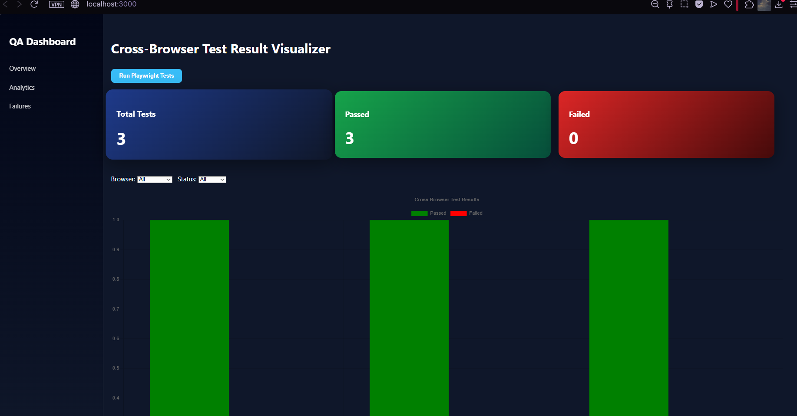
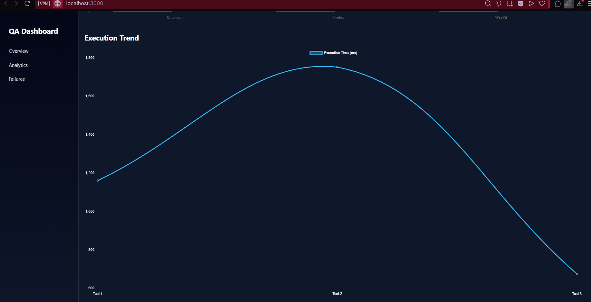
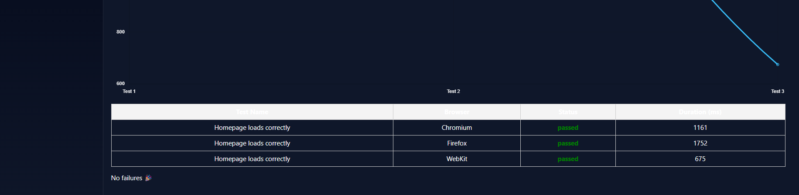

# Cross-Browser Test Result Visualizer

A modern **QA analytics dashboard** that visualizes Playwright cross-browser test results in real-time.

This project combines **Playwright automation, Node.js backend, WebSockets, and a React dashboard** to provide a powerful test monitoring interface for developers and QA engineers.

Users can run tests directly from the dashboard and instantly see analytics, browser comparisons, and execution trends.

---

# Features

Real-time dashboard updates using WebSockets  
Run Playwright tests directly from the UI  
Cross-browser testing (Chromium, Firefox, WebKit)  
Execution performance analytics  
Visual charts and trend analysis  
Summary cards for pass/fail statistics  
Failure diagnostics with error logs  
Screenshot preview for failed tests  
Interactive filtering by browser and status  

---

# Dashboard Screenshots

## Main Dashboard

---

## Execution Trend Chart

---

## Test Results Table

---

# Tech Stack

### Frontend
- React
- Chart.js
- Socket.IO Client
- Axios

### Backend
- Node.js
- Express
- Socket.IO

### Testing
- Playwright

### Deployment
- GitHub
- Render (Backend hosting)
- Vercel / GitHub Pages (Frontend hosting)

---

# System Architecture
# Cross-Browser Test Result Visualizer

A modern **QA analytics dashboard** that visualizes Playwright cross-browser test results in real-time.

This project combines **Playwright automation, Node.js backend, WebSockets, and a React dashboard** to provide a powerful test monitoring interface for developers and QA engineers.

Users can run tests directly from the dashboard and instantly see analytics, browser comparisons, and execution trends.

---

# Features

Real-time dashboard updates using WebSockets  
Run Playwright tests directly from the UI  
Cross-browser testing (Chromium, Firefox, WebKit)  
Execution performance analytics  
Visual charts and trend analysis  
Summary cards for pass/fail statistics  
Failure diagnostics with error logs  
Screenshot preview for failed tests  
Interactive filtering by browser and status  

---

# Dashboard Screenshots

## Main Dashboard

---

## Execution Trend Chart

---

## Test Results Table

---

# Tech Stack

### Frontend
- React
- Chart.js
- Socket.IO Client
- Axios

### Backend
- Node.js
- Express
- Socket.IO

### Testing
- Playwright

### Deployment
- GitHub
- Render (Backend hosting)
- Vercel / GitHub Pages (Frontend hosting)

---

# System Architecture
User
↓
React Dashboard
↓ WebSocket
Node Backend (Express + Socket.IO)
↓
Playwright Tests
↓
results.json
↓
Dashboard updates in real time
